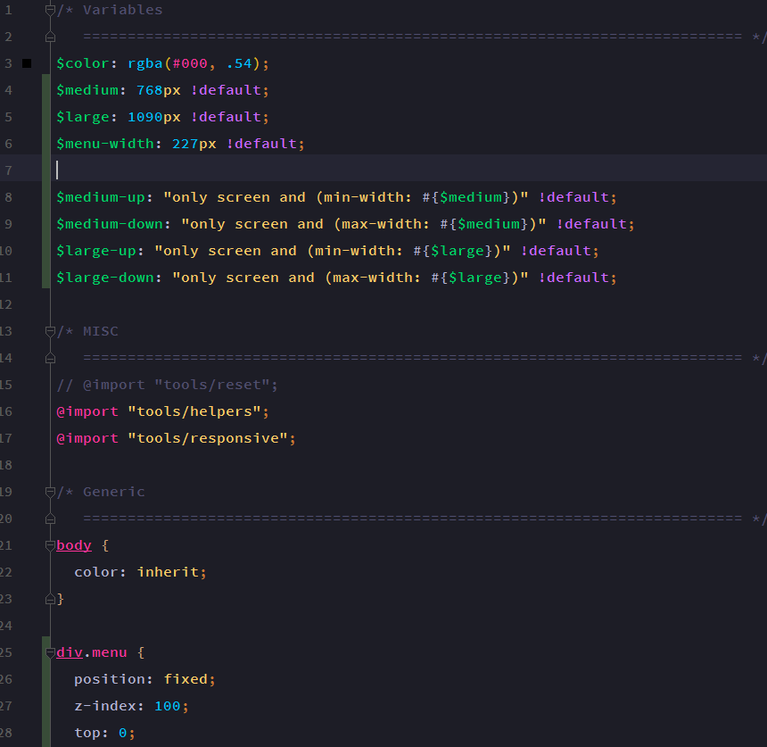
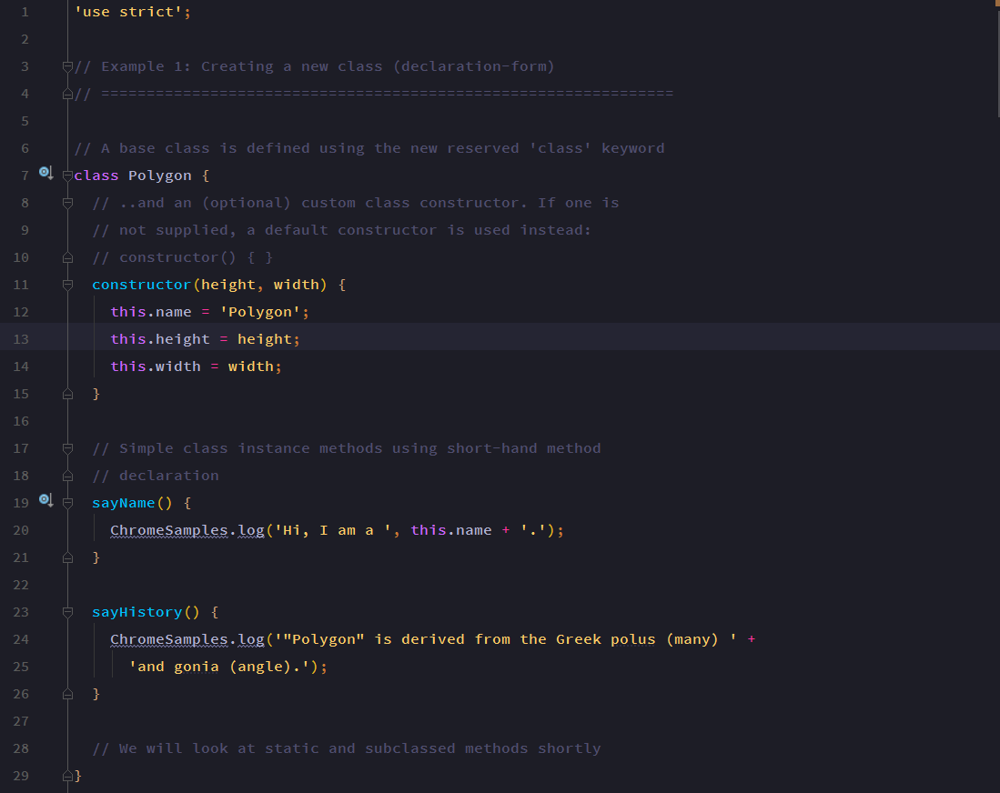
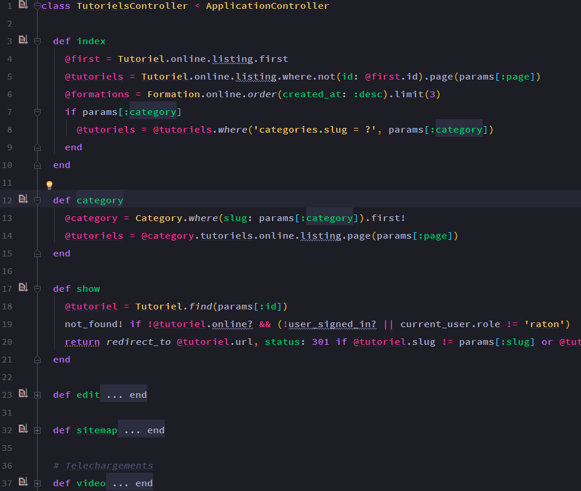
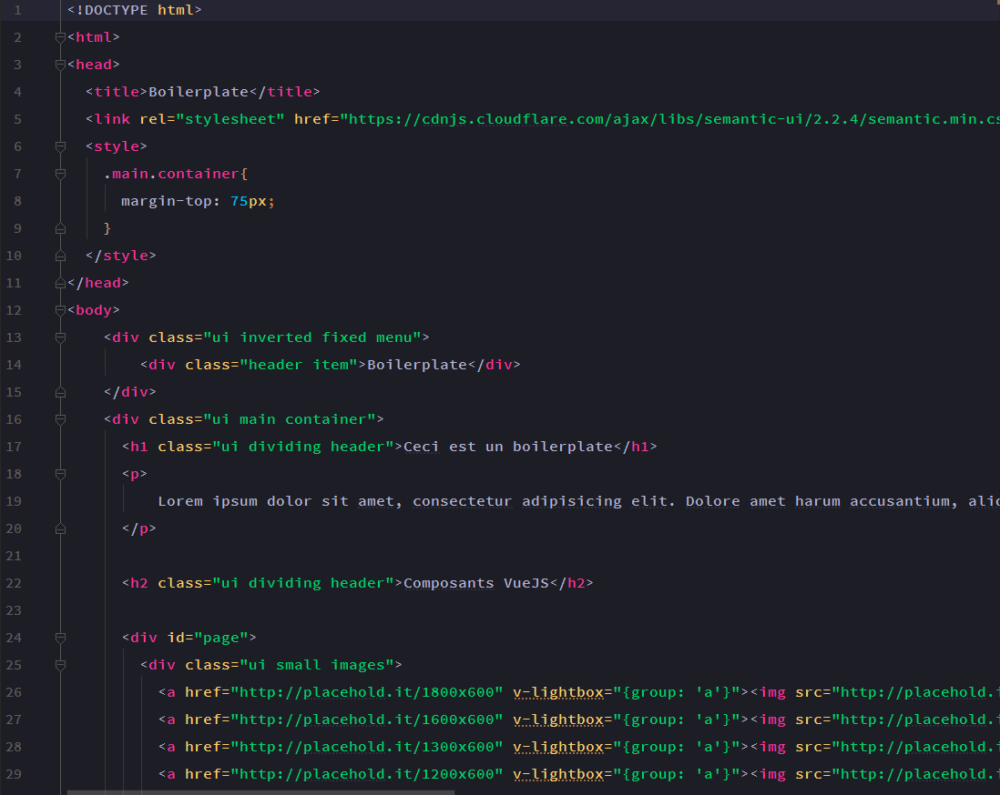

**Tinacious Design Syntax** is a dark syntax theme that uses a bright palette of colours including pink, blue, turquoise, green, purple, and orange.

Colours curated by Web and Mobile designer and developer Tina from [Tinacious Design](http://tinaciousdesign.com).
Adapted to IntellijIDEA by [Grafikart](https://grafikart.fr) (use with [Color Panel Helper](https://github.com/whilu/colorpanelhelper)).

The font used in the IntellijIDEA  [Source Code Pro Semibold](https://github.com/adobe-fonts/source-code-pro).

Also available for : 

- [Atom](https://github.com/tinacious/atom-tinacious-design-syntax)
- [Visual Studio Code](https://github.com/tinacious/vscode-tinacious-design-syntax)
- [Sublime Text](https://github.com/tinacious/sublime-tinacious-design-syntax)

### SCSS

### JavaScript (ES6)

### Ruby

### HTML

### PHP
